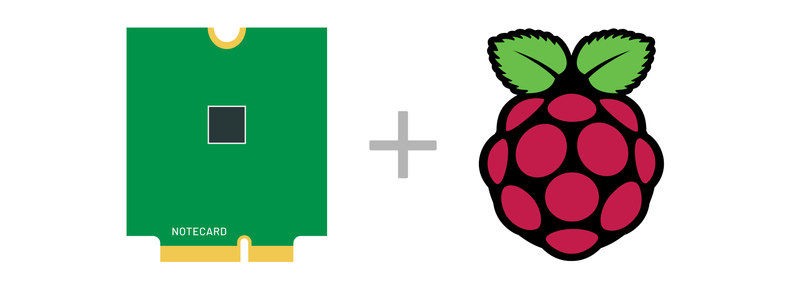

# Notecard Pico

Demonstration of using the [Blues Wireless Notecard](https://blues.io) with the [Raspberry Pi Pico](https://www.raspberrypi.org/products/raspberry-pi-pico/) and MicroPython. The [full project writeup is on Hackster.io](https://www.hackster.io/brandonsatrom/adding-cellular-to-the-raspberry-pi-pico-b8a4b6).

This repository contains the complete source for this project, including:

- Source for the [Notecard Python](https://github.com/blues/note-python) library.
- Source for an adapted Adafruit BME680 library that works with MicroPython.
- Project source to take BME680 readings and send those to the Notecard over I2C.

